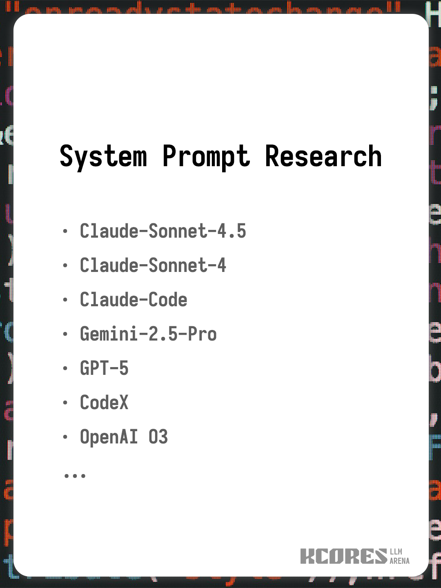

# 系统提示词研究

> 一个分析大型语言模型系统提示词的研究项目

## 概述

本项目包含对各种大型语言模型使用的系统提示词的详细分析和研究，重点关注其结构、设计原则和实施策略的理解。

## 目的

本研究旨在：

- 了解现代大型语言模型如何通过系统提示词进行配置
- 分析提示词工程中的设计模式和最佳实践
- 提供关于安全性、合规性和用户体验考虑因素的见解
- 记录商业AI助手背后的架构决策

## 研究方法

分析包括：

- 提示词结构的逐行分解
- 内容分布的统计分析
- 关键设计原则的识别
- 不同组件的复杂性分析

## 使用场景

本研究对以下人群有价值：

- 研究提示词工程的AI研究人员
- 构建AI助手的开发人员
- 设计AI功能的产品经理
- 任何对了解大型语言模型工作原理感兴趣的人

## 许可证

CC-BY-NC-SA-4.0

## 贡献

欢迎贡献、建议和讨论！请随时提出问题或提交拉取请求。

---

*最后更新：2025年10月*
